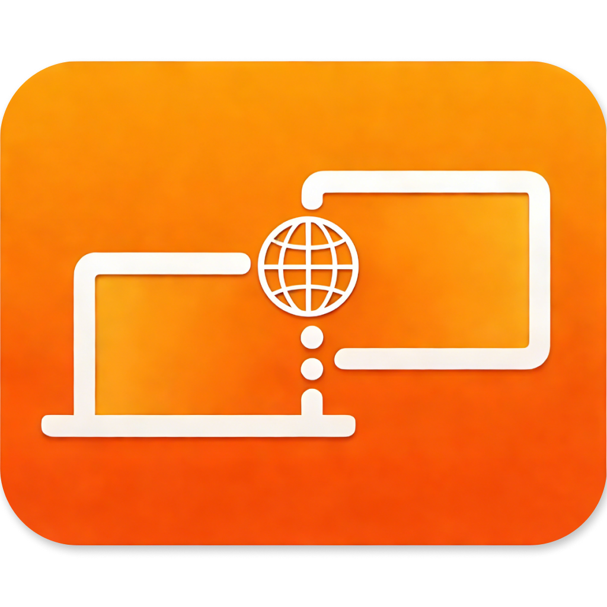

<div align="center">
  
</div>

# WebSidecar

**Turn any browser into a secondary display for your Mac.**

WebSidecar runs a local server on your Mac, streaming your display content to any device on your local network with low latency. Built with a modular architecture, it combines a high-performance **Swift** backend ⚡ and a modern **React** frontend ⚛️, all packaged into a native macOS menu bar application.

## 🚀 Installation and Usage

> ⚠️ **Compatibility Note**: This application requires **macOS 13+**. It has been tested primarily on a **MacBook Pro M1 Pro** running **macOS 26.2**.

### 📥 Instructions for Users

If you downloaded the pre-built application (e.g., from GitHub Releases), you might see a security warning since the app isn't notarized by Apple yet.

1. **Right-click** (or Control-click) `WebSidecar.app` and select **Open**.
2. Click **Open** again in the dialog to confirm.
3. The app will appear in your menu bar. Click the icon to open the web interface.

### 💡 Virtual Display Tip

For a true secondary monitor experience (instead of just mirroring), we recommend using **[DeskPad](https://github.com/Stengo/DeskPad/)**. It creates a virtual display on your Mac that WebSidecar can stream, giving you a dedicated workspace to move windows onto.

### ⚙️ Configuration

Adjust settings (resolution, video quality) directly via the **Web UI**. Changes are saved automatically.

**🛠️ Advanced Configuration:**

For manual overrides or headless setup, configuration is loaded from (in priority order):

1. `ENV`: `WEBSIDECAR_CONFIG=/path/to/config.json`
2. `Local`: `./config.json` (for CLI dev)
3. `User`: `~/Library/Application Support/com.yaindrop.websidecar/config.json` (App Default)

**Default Config:**

```json
{
  "maxDimension": 1920,
  "videoQuality": 0.75,
  "targetFps": 60,
  "dropFramesWhenBusy": true
}
```

## 🏗️ Project Structure

This project is a monorepo managed with `pnpm`:

- 📦 **packages/backend**: Swift library & CLI.
  - `ScreenCaptureKit` for high-performance, low-latency recording.
  - SwiftNIO MJPEG streaming server.
  - REST API for management.
- 🎨 **packages/frontend**: React + Vite SPA.
  - Clean UI for stream viewing and settings.
  - Ant Design + Tailwind CSS.
- 🍎 **packages/macos**: Native macOS menu bar app (SwiftUI).
  - Embeds backend server.
  - Serves compiled frontend static files.
  - System integration (Menu icon, Launch at Login).

## 👨‍💻 Development

### 📋 Prerequisites

- macOS 13.0+ (Required for ScreenCaptureKit)
- Xcode 14+ (Swift tooling)
- Node.js 18+ & pnpm

### 🛠️ Setup

1. Clone the repo:

   ```bash
   git clone https://github.com/yaindrop/web-sidecar.git
   cd web-sidecar
   ```

2. Install dependencies:
   ```bash
   pnpm install
   ```

### 🏃 Running the Application

#### Option A: Native macOS App (Recommended)

Builds the standalone menu bar application.

1. Build:

   ```bash
   pnpm build:app
   ```

   _Automatically builds frontend and packages the macOS app._

2. Run:
   ```bash
   open packages/macos/.build/release/WebSidecar.app
   ```

#### Option B: Development Mode

Run backend CLI and frontend dev server independently.

```bash
pnpm dev
```

- 🔌 Backend: http://localhost:9327
- 🖥️ Frontend: http://localhost:5173

### 📦 Building for Distribution

The `bundle_app.sh` script creates a locally signed application (ad-hoc).

**Sharing via GitHub:**
Uploaded `.app` zips will trigger macOS Gatekeeper warnings (see "Instructions for Users").

### ⚡ Tech Stack

- 🐦 **Swift**: Backend logic, HTTP Server, ScreenCaptureKit, SwiftUI.
- ⚛️ **React**: Frontend UI, Video Player.
- ⚡ **Vite**: Frontend tooling.
- 📦 **pnpm**: Package management.

## 🤖 Built with AI

The code of this project is ~95% written by **[Trae](https://trae.ai)**.

## 📄 License

MIT
